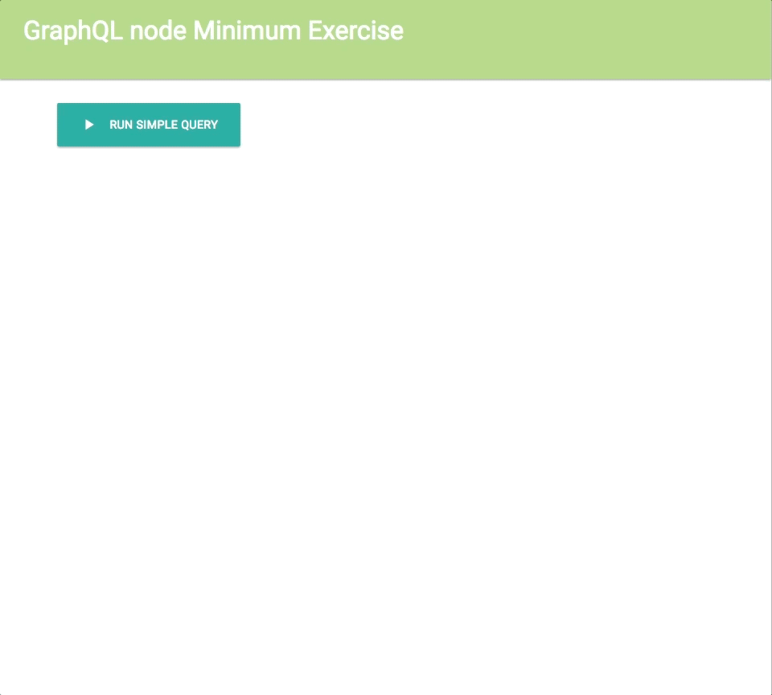

# GraphQL node Minimum Exercise [](https://travis-ci.org/ryota-murakami/graphql-node-minimum-exercise)

[](https://greenkeeper.io/)



referenced
http://graphql.org/graphql-js/

## Guide

### install
```
git clone git@github.com:ryota-murakami/graphql-node-minimum-exercise.git
cd graphql-node-minimum-exercise
yarn install
```

### Run App
```
// Run Server
yarn server

// Browser Access
http://localhost:4000/
```

### GraphQL Browser Editor
```
http://localhost:4000/graphql
```
